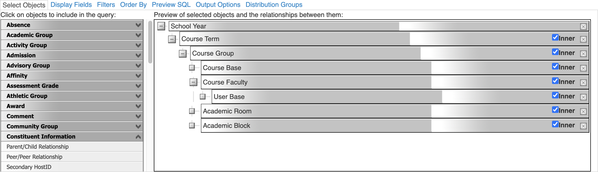
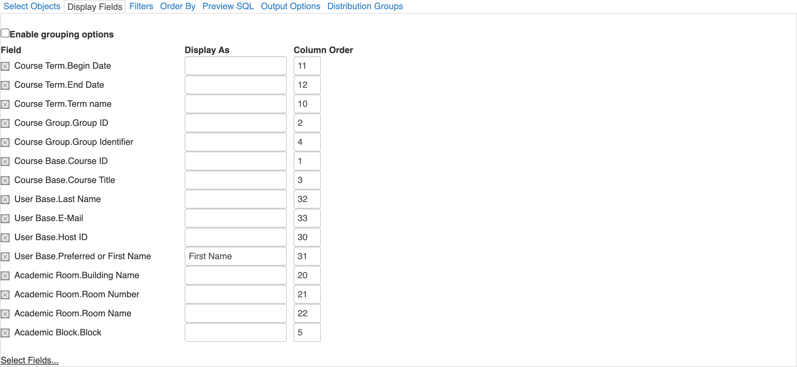
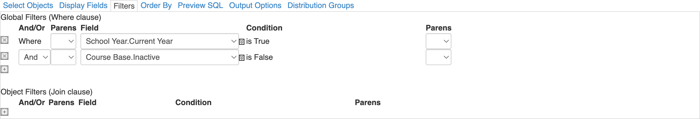

# Current Year Courses

Blackbaud Advanced List







### Preview SQL

```sql
select dcb1.course_id as [Course ID] , dag1.group_id as [Group ID] , dcb1.course_title as [Course Title] , dag1.group_identifier as [Group Identifier] , dab1.block as [Block] , dat1.term_name as [Term name] , dat1.begin_date as [Begin Date] , dat1.end_date as [End Date] , dar1.building_name as [Building Name] , dar1.room_number as [Room Number] , dar1.room_name as [Room Name] , dub1.host_id as [Host ID] , dub1.preferred_or_first_name as [First Name] , dub1.lastname as [Last Name] , dub1.email as [E-Mail] from
dbo.da_school_year(@p1)sy1 INNER JOIN dbo.da_academic_term(@p1)dat1 ON dat1.school_year = sy1.school_year INNER JOIN dbo.da_academic_group(@p1)dag1 ON dag1.term_id = dat1.term_id INNER JOIN dbo.da_course_base(@p1)dcb1 ON dcb1.course_id = dag1.course_id INNER JOIN dbo.da_academic_faculty(@p1)daf1 ON daf1.group_id = dag1.group_id INNER JOIN dbo.da_user_base(@p1)dub1 ON dub1.user_id = daf1.faculty_user_id INNER JOIN dbo.da_academic_room(@p1)dar1 ON dar1.room_id = dag1.room_id INNER JOIN dbo.da_academic_block(@p1)dab1 ON dab1.block_id = dag1.block_id
where sy1.current_year = 1 And dcb1.inactive = 0
```
